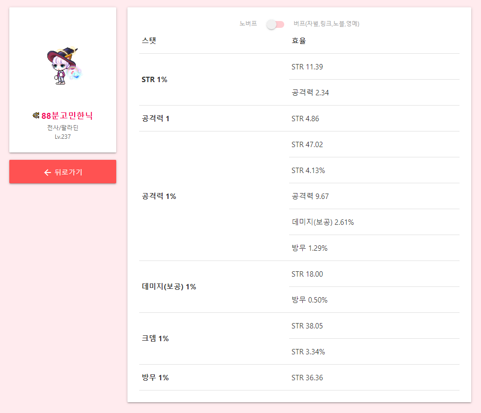

## About The Project


본 프로젝트는 메이플스토리 게임의 스펙을 계산하여 어떤 스탯을 올리는 것이 효율적인지를 계산해주는 툴입니다. 닉네임 입력만으로 간단하게 스탯 효율을 계산할 수 있습니다.

### Built With
* [Docker](https://github.com/docker)
* [Express](https://github.com/expressjs/express)
* [Nginx](https://github.com/nginx/nginx)
* [Svelte](https://github.com/sveltejs/svelte)

## Getting Started

### Prerequisites

* docker

Docker를 사용하여 구동이 가능합니다. docker-compose가 사용이 가능한 환경이어야 합니다. [설치 안내](https://docs.docker.com/compose/install/)

### Installation
1. clone the repository
```
git clone http://khuhub.khu.ac.kr/2017104005/oss-maple.git
```

2. branch release
```
git branch release
```

3. docker on
```
docker-compose up
```

4. (optional) 80(http) 또는 443(https) 포트로 포워딩

포워딩하지 않은 경우 8081 포트로 프로젝트가 실행됩니다.

## Preview

[maplespec.ga](https://maplespec.ga)

공개설정이 된 메이플스토리 캐릭터 이름(ex 88분고민한닉, 54분고민한닉, 72분고민한닉)을 입력하여 사용할 수 있습니다.

## Contributing

프로젝트에 기여하고 싶으신 분들은 아래 절차를 따라주시기 바랍니다.

1. 프로젝트 fork
2. feature branch 생성 (`git checkout -b feature/n-name`) (프로젝트 feature를 구분하기 위해 feature name 앞에 숫자를 넣습니다.)
3. commit (`git commit -m "Add feature`)
4. push (`git push origin feature/n-name`)
5. pull request 생성

본 프로젝트는 기여를 환영합니다.

## Contact

* 오윤석, dhdbstjr98@khu.ac.kr
* 오윤석, admin@com1.kr